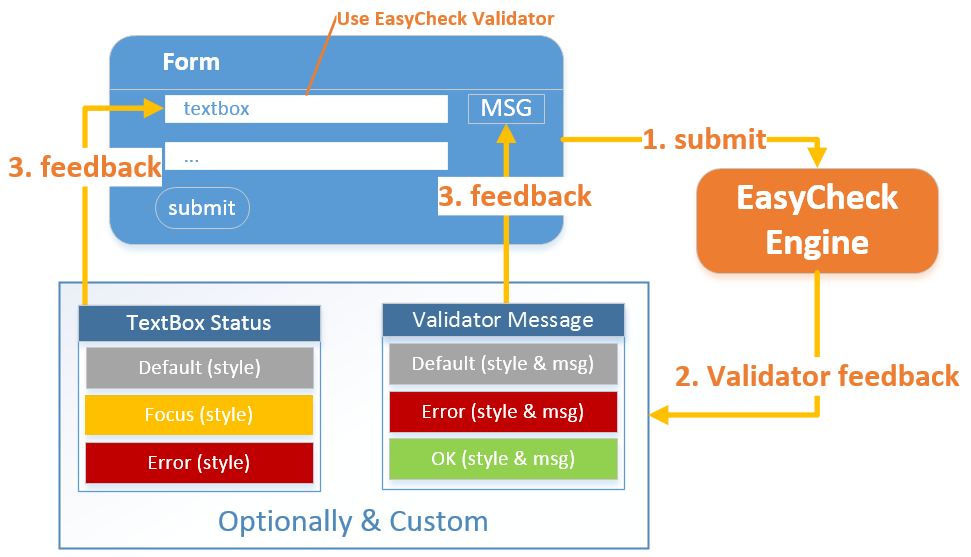
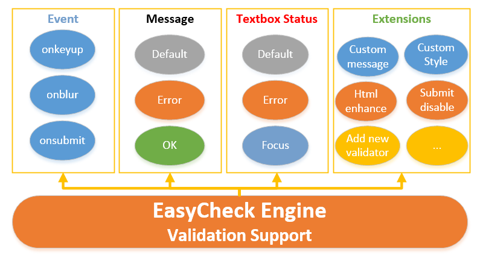

# EasyCheck验证插件使用手册

---------------

EasyCheck又名Echeck，是一个基于jQuery的前端JS表单验证插件，无需编程通过HTML增强即可完成表单验证工作，简化前端开发工作，并保持统一验证风格，提高效率。

**主要特点：**
1. 轻量级
2. 无需JS编程
3. 支持基于类、基于属性和组合验证器
4. 内置能满足日常开发的十多种常用验证器
5. 文本框验证样式自动切换
6. 默认、错误和正确三种DIV提示消息内容
7. 提示消息位置的自定义
8. 防客户端重复提交功能
9. 扩展性，支持用户开发注册新验证器

**兼容性**：
EasyDataTable完全兼容IE6及以上版本、Firefox、Chrome、Safari、Opera等各内核（Trident、Gecko、Webkit、Presto）浏览器，并兼容多平台及系统（PC，TabletPC，Mobile）。

- [中文说明文档](doc/readme-zh_CN.md)

EasyCheck aka Echeck, is a front-end based on JS jQuery form validation plugin, without programming through HTML form validation enhancements to complete the work, simplifying the work of front-end development, and to maintain the unity of style to verify and improve efficiency.

**Main features:**
1. Lightweight
2. No JS programming
3. Support class-based, based on a combination of property and validators
4. Built to meet the daily development of a dozen popular validator
5. Verify that the text box to automatically switch styles
6. By default, three kinds of errors and correct the prompt message content DIV
7. Tip custom message location
8. Anti-client resubmit function
9. scalability, support for registered users to develop new validator

**Compatibility:**
EasyDataTable fully compatible with IE6 or later, Firefox, Chrome, Safari, Opera, and other kernel (Trident, Gecko, Webkit, Presto) browser, and is compatible with multiple platforms and systems (PC, TabletPC, Mobile).

- [English readme](doc/readme-en.md)

### [官方主页](http://www.easyproject.cn/easycheck/zh-cn/index.jsp '官方主页')

[留言评论](http://www.easyproject.cn/easycheck/zh-cn/index.jsp#donation '留言评论')

如果您有更好意见，建议或想法，请联系我。

### [The official home page](http://www.easyproject.cn/easycheck/en/index.jsp The official home page')

[Comments](http://www.easyproject.cn/easycheck/en/index.jsp#donation 'Comments')

If you have more comments, suggestions or ideas, please contact me.

Email：<inthinkcolor@gmail.com>

[http://www.easyproject.cn](http://www.easyproject.cn "EasyProject Home")

</img>

<form action="https://www.paypal.com/cgi-bin/webscr" method="post" target="_blank">
<input type="hidden" name="cmd" value="_xclick">
<input type="hidden" name="business" value="inthinkcolor@gmail.com">
<input type="hidden" name="item_name" value="EasyProject development Donation">
<input type="hidden" name="no_note" value="1">
<input type="hidden" name="tax" value="0">
<input type="image" src="http://www.easyproject.cn/images/paypaldonation5.jpg"  title="PayPal donation"  border="0" name="submit" alt="Make payments with PayPal - it's fast, free and secure!">
</form>

